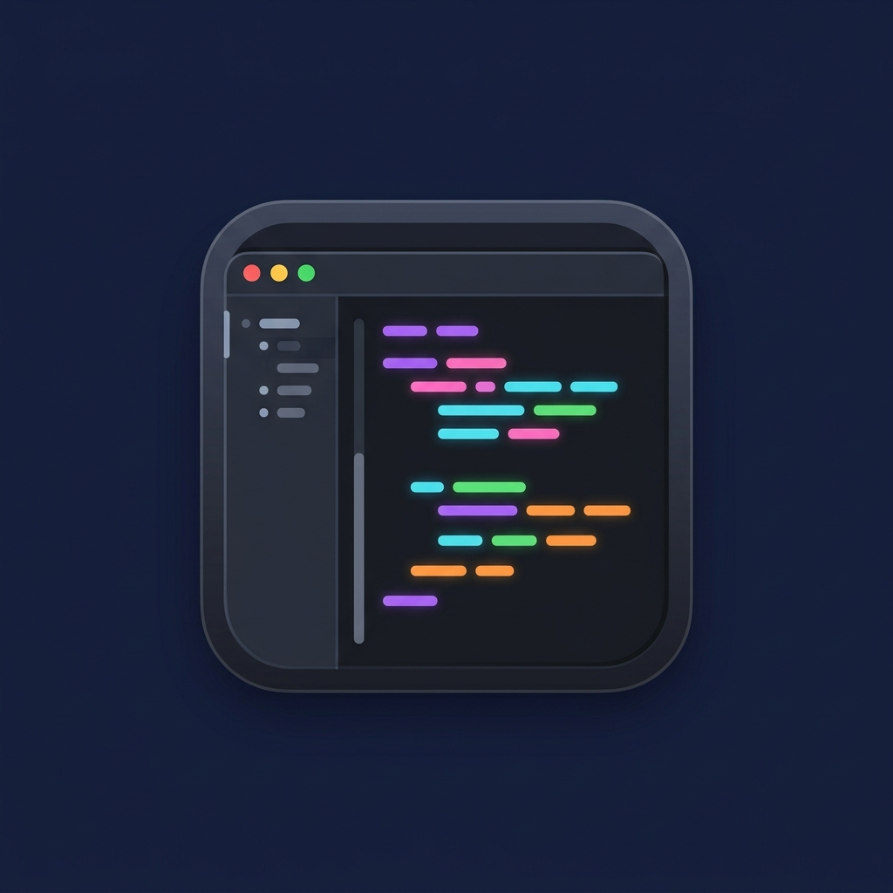
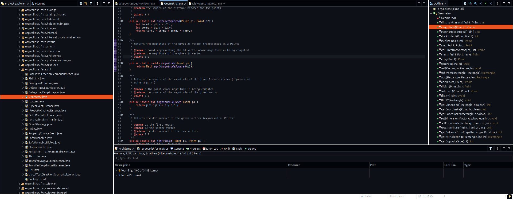
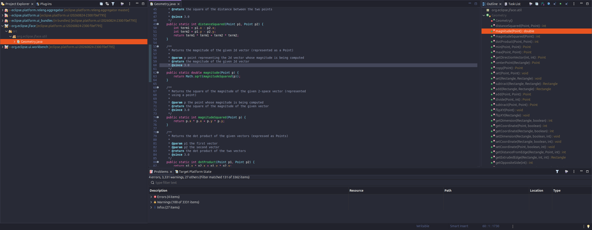
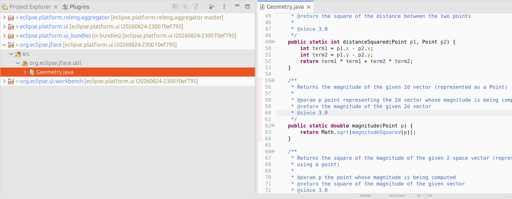
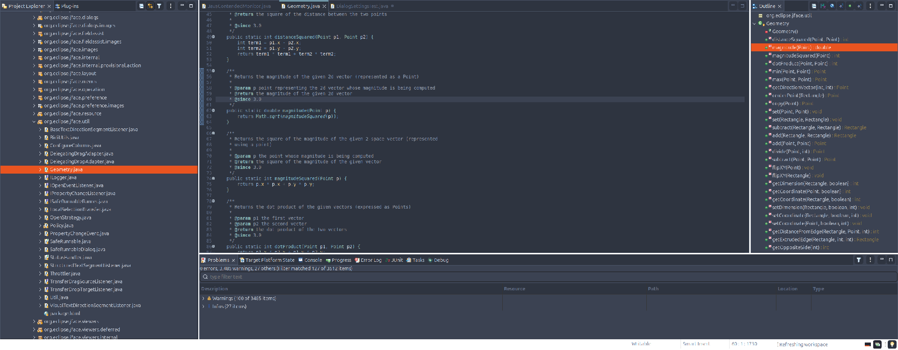
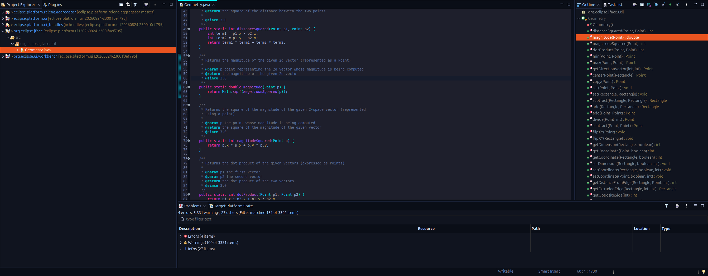
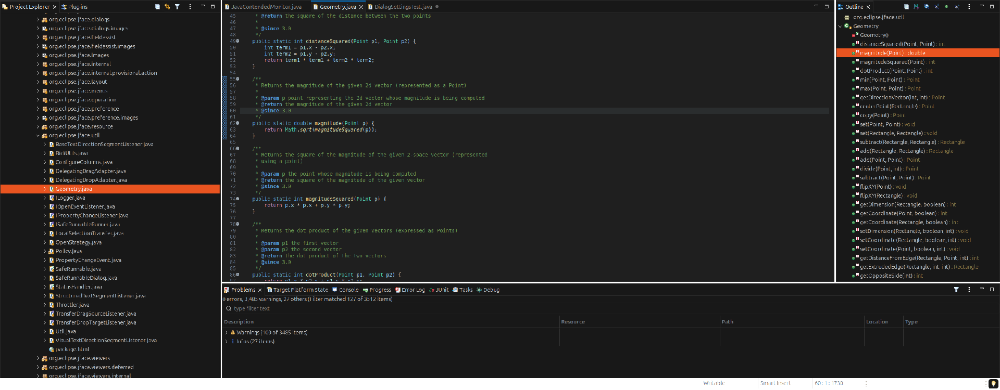

# vogella Eclipse Themes

Additional themes for the Eclipse IDE, shipped as an installable p2 update site.
The themes themselves are pure resource plugins: CSS and preference definitions only.
One companion plugin carries Java, `com.vogella.eclipse.themes.gtk`, and only because the widgets SWT hands to GTK cannot be reached from a stylesheet at all; see [Widgets GTK paints](#widgets-gtk-paints).

## Installing

In Eclipse: *Help > Install New Software*, and add this update site:

```
https://vogellacompany.github.io/eclipse-themes/
```

Every theme is a feature of its own, so install one, several or all six.
Then switch under *Preferences > General > Appearance* to the installed theme.

The site carries the newest build and nothing else, published from `main` by the [Release workflow](.github/workflows/release.yml).
Older versions are not supported: the previous build is dropped when a new one is published, so update rather than pin.

To install from your own build rather than the hosted site, see [Building](#building), then point *Add > Local* at

```
update-site/com.vogella.eclipse.themes.repository/target/repository
```

Note on preference based colors: when you switch to a theme, the theme writes its values into the affected preferences (editor colors, Java syntax highlighting, console colors), overwriting whatever was set before, including hand tuned settings.
The built-in dark theme behaves the same way.
If you want your own colors back, re-tune them under *Preferences > General > Appearance > Colors and Fonts* after switching.

The Linux stylesheets are the ones exercised by this repository's build and testing.
The Windows and macOS variants ship untested until someone runs them there.

## Themes

Every theme builds on a platform stylesheet of `org.eclipse.ui.themes`, the dark one or the light one, and recolors it through shared `ColorDefinition` tokens, so a theme change is a palette change, not a rewrite.

### GitHub Dark

GitHub's Primer dark palette: blue-black surfaces with the familiar blue accent and GitHub syntax colors.



### Dracula

The official Dracula palette on purple tinted surfaces with pink and purple accents.



### One Light

Atom's One Light palette: a near white editor on a soft grey chrome, with purple keywords, green strings and the blue accent.



Known issue on GTK: One Light currently renders the whole IDE with a noticeably larger UI font than the five dark themes, which is why fewer views fit in its screenshot above.
It is reproducible from a freshly started IDE and it flips the moment you switch between One Light and any of the dark themes, so it is the theme and not the workspace.
None of the stylesheets set a font size, so the cause is not in this repository's CSS; the working theory is the GTK theme reload that `ThemeEngine` triggers through `Display.setDarkThemePreferred` for a theme whose id does not contain `dark`.

### Nord

Calm arctic blues and frost accents on Polar Night surfaces, following the official Nord palette.



### AI Neon

Deep blue-violet surfaces with cyan links, tab titles and keylines, and magenta on errors and active links.



### VS Code Dark

The VS Code Dark Modern look, including its tab styling and Dark+ syntax colors.



All six are the same workspace, the same file and the same maximized window, captured on GTK at 200% scaling.
The five dark ones differ from each other only in the theme; One Light differs in layout too, for the reason noted above.
The orange row selection in the trees predates `com.vogella.eclipse.themes.gtk` and is the desktop accent color rather than the theme; it now follows the palette, and the screenshots are due a retake.

## Widgets GTK paints

SWT draws most of the IDE itself, but it hands a short list of widgets to GTK and offers the CSS engine no property that reaches them.
Those widgets keep the desktop GTK theme's colors however complete an Eclipse theme is, which is why a selected row used to come out in the desktop accent inside an otherwise dark IDE.
The list is the selection in every tree, table and list, the scrollbars, the menu bar and every context menu, the hover tooltips, the check box and radio button indicators, the scales and the native file, print, color and font dialogs.

`com.vogella.eclipse.themes.gtk` closes it, on Linux only.
It resolves one stylesheet against the active theme's palette and loads it into a GTK style provider attached to the Eclipse display, so it colors Eclipse and changes nothing about your desktop or any other application.
It follows a theme switch, and switching to a theme that is not one of these hands the widgets straight back to the desktop theme.

The plugin comes with each theme feature and needs no setup.
To turn it off, clear it under *Preferences > General > Startup and Shutdown*, or launch with `-Dcom.vogella.eclipse.themes.gtk=false`.
What it still cannot reach is the window decorations, which belong to the window manager.

Everything else about theming stays in CSS.
The stylesheet is deliberately narrow, and [AGENTS.md](AGENTS.md) explains why it has to be: it is loaded at a priority that outranks the CSS engine, so anything it names it takes over completely.

### If these widgets keep the desktop colors

The plugin writes one line to the log every time it applies or clears the stylesheet, so start at *Window > Show View > Error Log*, or `<workspace>/.metadata/.log`.
A line reading `GTK stylesheet applied for com.vogella.eclipse.themes.draculadark` means it did its work and anything still wrong is a missing rule; a warning names what it could not do; and no line at all means it never ran.

For no line at all, in order of likelihood:

- The bundle is not in the running configuration.
  In a self-hosted *Eclipse Application* launch this is the usual answer: a launch configuration whose Plug-ins tab is set to *plug-ins selected below* does not pick up plug-in projects added to the workspace later, so `com.vogella.eclipse.themes.gtk` sits there unchecked.
  Either check it, or switch the tab back to *all workspace and enabled target plug-ins*.
- Early startup is switched off for it under *Preferences > General > Startup and Shutdown*, or the launch passes `-Dcom.vogella.eclipse.themes.gtk=false`.
- The theme active in the running IDE is not one of these six.
  A launch configuration with a fresh runtime workspace starts on the platform's own theme, and the plugin correctly does nothing then; pick a vogella theme under *Preferences > General > Appearance* in the launched instance.
- The platform is not GTK. The bundle carries `Eclipse-PlatformFilter: (osgi.ws=gtk)` and does not resolve anywhere else, by design.

## Building

```
mvn clean verify
```

Maven has to run on JDK 25 or newer, because the target platform is resolved against the
`JavaSE-25` execution environment configured in `pom.xml`.
Three checks run beside it, and the CI runs all three: `releng/check-tokens.sh` for the token
contract, `releng/check-gtk-palettes.sh` for the GTK palette copies, and
`releng/check-gtk-stylesheet.py` to parse the GTK stylesheet with GTK's own engine, which
needs `python3-gi`, `gir1.2-gtk-3.0` and `xvfb-run` and skips itself without them.
The build is pomless Tycho (5.0.4) against the Eclipse 2026-06 release train target platform, with the modern CSS variant bundle and the update site resolved against 2026-09 (see [AGENTS.md](AGENTS.md)).
The resulting p2 repository lands in
`update-site/com.vogella.eclipse.themes.repository/target/repository/`.

Pushing to `main` runs that same build and publishes the result to the hosted update site, on the `gh-pages` branch.
The site carries one build at a time: `releng/update-composite-site.sh` writes the p2 composite metadata that points the root URL at it, and drops what came before.
A tag of the form `v*` additionally attaches the repository archive to a GitHub release.

The published artifacts are PGP signed with the vogella release key, held in the `MAVEN_GPG_KEY`
and `MAVEN_GPG_PASSPHRASE` organization secrets. Signing is off in a plain `mvn clean verify`; to
exercise it locally, point Tycho at an exported secret key:

```
mvn clean verify -Dgpg.skip=false -Dtycho.pgp.signer.bc.secretKeys=/path/to/signing-key.asc
```

with the passphrase in `MAVEN_GPG_PASSPHRASE`.

## Adding a theme

Copy an existing bundle under `plugins/` and replace the old bundle symbolic name everywhere
in the copy.
Copy a dark theme for a dark one and `com.vogella.eclipse.themes.onelight` for a light one:
the two differ in which platform stylesheet the `*_gtk.css`, `*_win.css` and `*_mac.css` files
import, and in whether `javadocElementsStyling.darkModeDefaultColors` is `true` or `false`.
That last part is the step that is easy to miss: the base stylesheets import the palette and
the preference sheets through `platform:/plugin/<bundle>/css/...` URIs, and every
`ColorDefinition` label is a `platform:/plugin/<bundle>?message=...` URI.
A copy that keeps the old name silently renders with the old theme's palette when that bundle
is installed, and renders black when it is not.

Then rename the theme id and the `%theme.*` key pair in `plugin.xml` and `plugin.properties`,
keeping in mind that `ThemeEngine` decides whether to put GTK itself into dark mode by testing
whether the theme id contains `dark`, so a dark theme needs it in the id and a light theme must
not have it,
rename the `.project` name and `Automatic-Module-Name`, replace the palette values and the
preference stylesheets (`*_preferences.css` and `*_jdt.css`, plus `vscode_tabs.css` if you
copied the VS Code theme), add a feature under `features/` and list it in the update site
`category.xml`.
Then run `./releng/check-gtk-palettes.sh --write`, which copies the new palette's values into
`plugins/com.vogella.eclipse.themes.gtk/palettes/<theme id>.properties` for the GTK stylesheet
to resolve against. It has to be a copy rather than a lookup, because the values are needed
before the CSS engine has applied them; the same script without `--write` fails the build when
the copy and the stylesheet disagree, so a later palette change cannot go one way only.
Finally run `./releng/check-tokens.sh`, which verifies the token contract for every palette it
finds.
No pom changes are needed, the pomless aggregator picks up new directories automatically.

## License

Eclipse Public License 2.0, see [LICENSE](LICENSE).

## Commercial support

[vogella GmbH](https://vogella.com/services/) builds and maintains these themes and offers training and consulting around Eclipse, the Eclipse platform and its tooling.

If you use these themes in earnest and something looks wrong, saying so is welcome either way: the issues and pull requests here are open, and the commercial route exists for work that wants a schedule attached.
